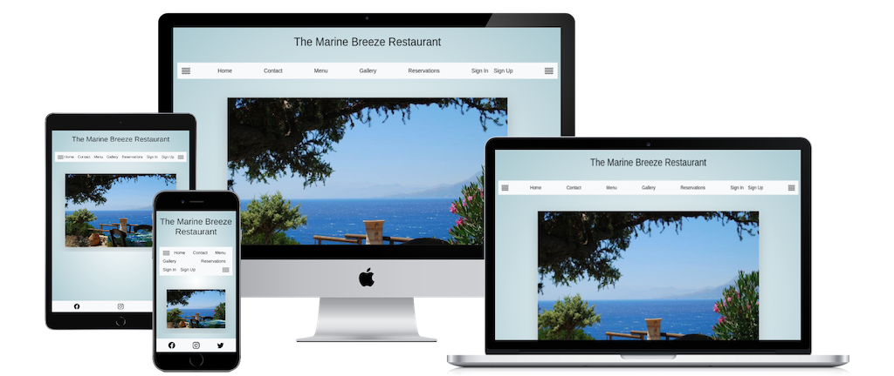
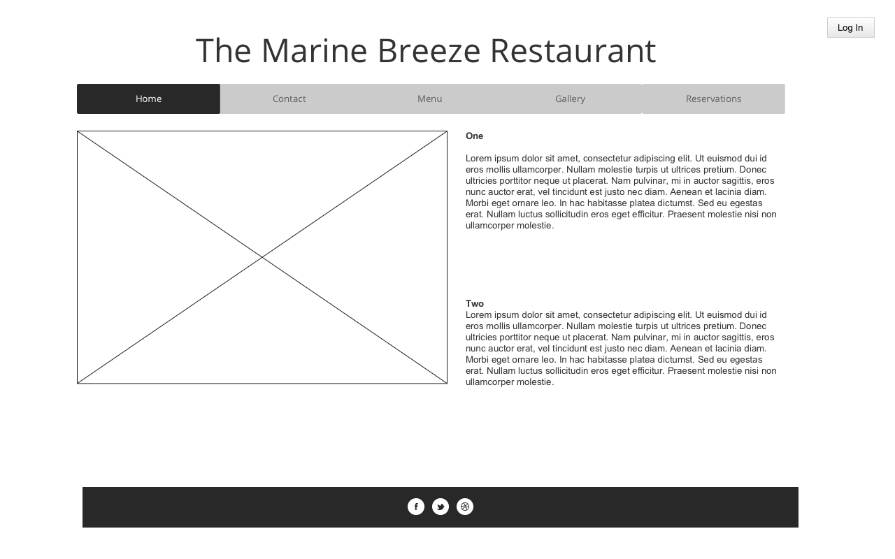
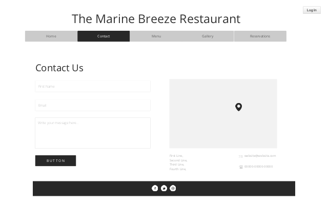
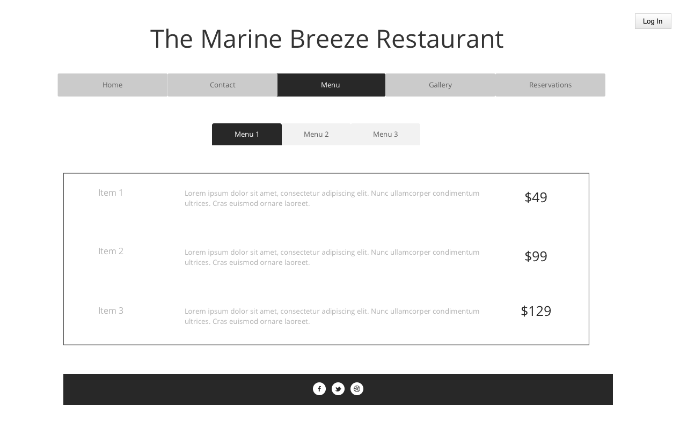
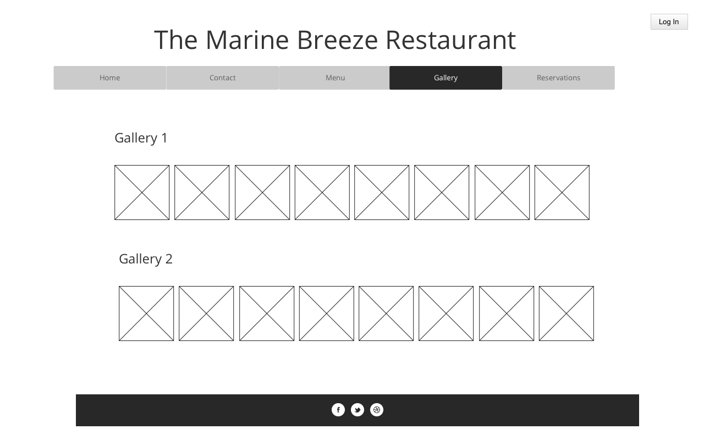

# The Marine Breeze Restaurant



## Overview


* External user = restaurant patron
* Site owner = restaurant manager

### External user’s goal:			

The user would like to book a table at the restaurant on a specific date and number of seats, while also know the start and finish time of the reservation. 

In additon booking a table, they would also like to cancel the reservation. 

### Site owner's goal:			

The site owner would like the ability to take online bookings for their eatery, freeing up staffs time to focus on guests physically at restaurant. 


## UX

### User Stories

* External user = restaurant patron
* Site owner = restaurant manager

As a external user, 

### Wireframes

* Home Page



* Contact Page


 
* Menu Page



* Gallery Page



* Reservations Page


### Feaures

### Database Schema

## Technologies & Services Used

### Languages Used

* [Python](https://developer.mozilla.org/en-US/docs/Glossary/HTML5) - used to install and configure django's settings, models, views, urls.
* [Django](https://developer.mozilla.org/en-US/docs/Glossary/HTML5) - used to create 
* [HTML](https://developer.mozilla.org/en-US/docs/Glossary/HTML5) - used to define the content and structure of website.
* [CSS](https://developer.mozilla.org/en-US/docs/Web/CSS) - used to define the appearance and presentation of the website.

#### Servies Used

* [Git](https://www.atlassian.com/git) - used for branching, merging, and rewriting repository history.
* [GitHub](https://github.com/) - used a hosting service for Git repositories.
* [Gitpod](https://gitpod.io/) - used as a workspace for Git repositories.
* [Heroku](https://www.heroku.com/) - used as to deploy the application. 
* [AWS S3](https://aws.amazon.com/s3/) - used as storage of static and media files (CSS, JavaScript and images) 

#### Libraries Used


## Testing

For all testing documentation, please refer to [TESTING](TESTING.md)

## Deployment

### Local Deployment

To make a local copy of this repository, you can type the following into your IDE terminal:

- `git clone https://github.com/declanosullivan/the-marine-breeze-restaurant.git`

Alternatively, if using Gitpod, you can click below to create your own workspace using this repository.

[](https://gitpod.io/#https://github.com/declanosullivan/the-marine-breeze-restaurant/)

### AWS S3 Storage


### Heroku Deployment

Prerequisites

- Any changes inteded to be depployed to Heroku should be pushed to Github repository.
- Installed the [Heroku CLI](https://devcenter.heroku.com/articles/heroku-cli#install-the-heroku-cli)
- Your env.py file open in Gitpod.
- Ensuring your [requirements.txt](https://github.com/declanosullivan/the-marine-breeze-restaurant/blob/main/requirements.txt) is up to date. 
- You can do so using by entering the following line in your terminal:
- Create a file at root directory level runtime.txt and inside your Python version to ensure the same version of Python runs on the heroku deployment. 

```
pip3 freeze --local > requirements.txt
```

Step 1 - Creating an account.

- If you already have a Heroku account, please sign in to your existing account.
- If you don't, go to [Heroku.com](https://www.heroku.com) and create a free account.

Step 2: Create an app.

- Click on the 'New' drop down in the upper right-hand corner.
- Select 'Create a new app'.
- When choosing an app name, it will need to be unique to Heroku.
- If the Github repository name or project name is not available, choose a name similar by adding other words, dashes, letters or numbers.
- Enter your chosen 'App name' and select your region.
- Click the 'Create app' button.

Step 3: Add Config Vars.

- Go to the 'Settings' tab in your app.
- Scroll down to the 'Config Vars' section and click the 'Reveal Config Vars' button.
- We are going to copy several config vars from your env.py file in Gitpod.
- The follow enviromental varibales from env.py should be added to Heroku:

os.environ.setdefault("SECRET_KEY", "SECRET_KEY")
os.environ.setdefault("AWS_ACCESS_KEY_ID", "AWS_ACCESS_KEY_ID")
os.environ.setdefault("AWS_SECRET_ACCESS_KEY", "AWS_SECRET_ACCESS_KEY")
os.environ.setdefault("AWS_STORAGE_BUCKET_NAME", "AWS_STORAGE_BUCKET_NAME")
os.environ.setdefault("AWS_URL", "AWS_URL")
os.environ.setdefault("USE_S3", "True")
os.environ.setdefault("DATABASE_URL", "DATABASE_URL")
DISABLE_COLLECTSTATIC=1

Step 4: Add Buildpacks.

- On the same 'Settings' tab in your app, scroll down to the 'Buildpacks' section. 
- Add the python buildpack. 

Step 5 - Access Heroku via the terminal

- In the terminal, type:

```
heroku login
```

- It will then open the heroku login page in your browswer. 
- Enter your credentials and login. The terminal should confirm it's succesful. 
- If this doesn't work and you the following error message "IP address mismatch", you can instead try:

```
heroku login -i
```

- You will enter your email address and the API key from your [Heroku account page](https://dashboard.heroku.com/account).

Step 5 - Connect to the Heroku app & push to main

- In the termnial, 

```
heroku git:remote -a the-marine-breeze-restaurant
```

- If you completed any necessary pull requests from branches to update the main on your github repository:

'''
git push heroku main
'''

- If you are working from a branch but don't want to complete a pull request and you can push your changes from the github branch to heroku main:

'''
git push branchname:main
'''

- Once deployment to Heroku is successully completed, you should a similar message in the terminal:

'''
remote: Verifying deploy... done.
To https://git.heroku.com/the-marine-breeze-restaurant.git
   7aed2cc..f9d96fe  admin2 -> main
'''

## Credits and Learning Experience

### Content

- Menus are from the the restaurant [Sole](https://www.sole.ie/)

### Media

- All images are from [Pixabay](https://www.pixabay.com)

### Acknowledgements
