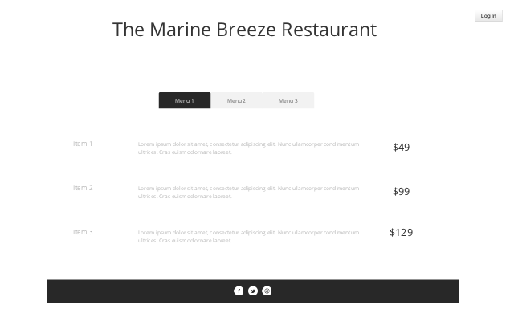

# The Marine Breeze Restaurant

Responsive mock up needed

## Overview

* External user = restaurant patron
* Site owner = restaurant manager

### External user’s goal:			

The user would like to book one or more guests for a meal in a restaurant and a particular time and date.	

### Site owner's goal:			

The site owner would like the ability to take online bookings for their eatery.	

## UX

### User Stories

* External user = restaurant patron
* Site owner = restaurant manager

As a external user, 

### Wireframes

* Home Page

* Contact Page

 
* Menu Page

* Gallery Page

* Reservations Page

### Feaures

### Database Schema

## Technologies

### Languages Used

### Libraries and Programs Used

#### Programs Used

#### Libraries Used

## Testing

For all testing documentation, please refer to [TESTING](TESTING.md)

## Deployment

### Local Deployment

To make a local copy of this repository, you can type the following into your IDE terminal:

- `git clone https://github.com/declanosullivan/the-marine-breeze-restaurant.git`

Alternatively, if using Gitpod, you can click below to create your own workspace using this repository.

### Heroku Deployment

## Credits and Learning Experience

### Content

### Media

### Acknowledgements
