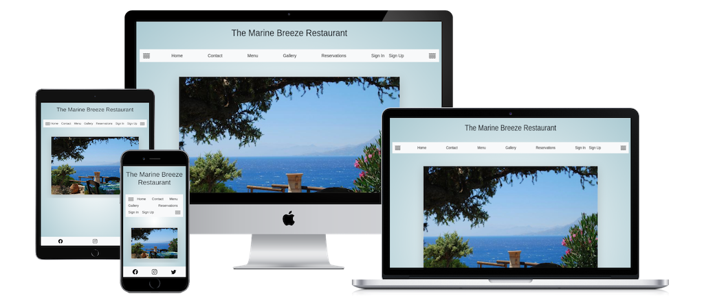

# Testing

## Code Validation

CSS is provided by Bootstrap. Any custom CSS is in the base.css file in the static folder.

* CSS Validation using [W3C CSS Validator Services](https://jigsaw.w3.org/css-validator/#validate_by_input).

## Performance testing

#### Lighthouse Report